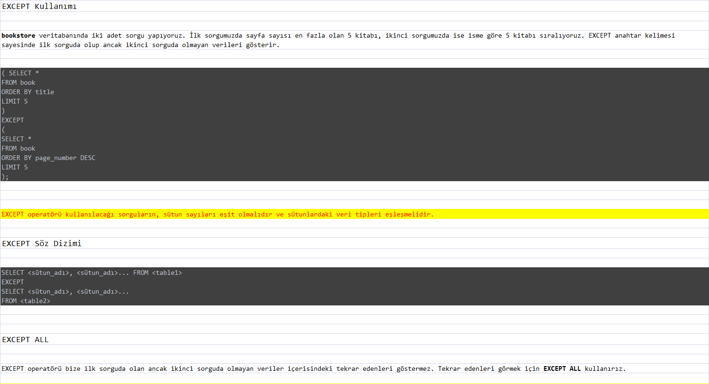

Aşağıdaki sorgu senaryolarını dvdrental örnek veri tabanı üzerinden gerçekleştiriniz.

-- city tablosu ile country tablosunda bulunan şehir (city) ve ülke (country) isimlerini birlikte görebileceğimiz LEFT JOIN sorgusunu yazınız.

SELECT city.city, country.country FROM city
LEFT JOIN country ON city.country_id=country.country_id;

[img_3.png](img_3.png)

---
-- customer tablosu ile payment tablosunda bulunan payment_id ile customer tablosundaki first_name ve last_name isimlerini birlikte görebileceğimiz RIGHT JOIN sorgusunu yazınız.

[img_4.png](img_4.png)

---
-- customer tablosu ile rental tablosunda bulunan rental_id ile customer tablosundaki first_name ve last_name isimlerini birlikte görebileceğimiz FULL JOIN sorgusunu yazınız.

