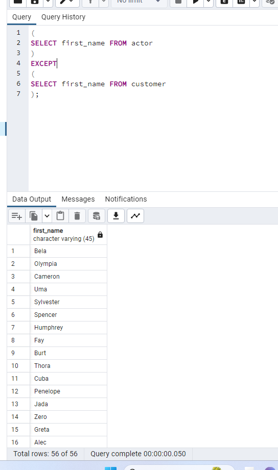

Aşağıdaki sorgu senaryolarını dvdrental örnek veri tabanı üzerinden gerçekleştiriniz.

actor ve customer tablolarında bulunan first_name sütunları için tüm verileri sıralayalım.

---
actor ve customer tablolarında bulunan first_name sütunları için kesişen verileri sıralayalım.

---
actor ve customer tablolarında bulunan first_name sütunları için ilk tabloda bulunan ancak ikinci tabloda bulunmayan verileri sıralayalım.

---
İlk 3 sorguyu tekrar eden veriler için de yapalım.

